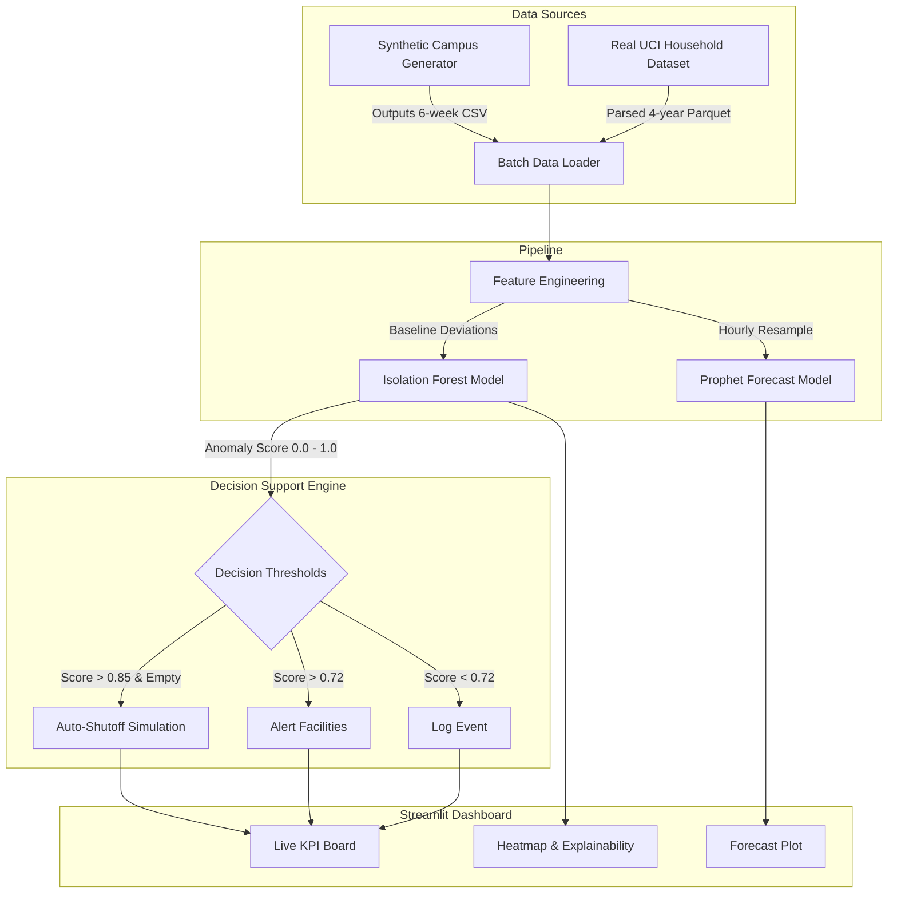

# ⚡ GreenGrid — Campus Energy Intelligence System

> Data-driven energy anomaly detection and forecasting system for campus and residential environments.

---

## 📊 Data Provenance Statement

This repository handles two distinct datasets:

| Data Source | Description | Anomaly Labels | Occupancy Sensor |
|---|---|---|---|
| **Synthetic campus data** | 8 rooms, 6 weeks, 5-min intervals, injected anomalies | YES | YES |
| **Real UCI household data** | Single household, 3 circuits, Dec 2006–Nov 2010 | NO | NO |

---

## 📊 Validated Metrics

### Synthetic Campus Data
| Model | Metric | Value |
|---|---|---|
| Isolation Forest | F1 Score | **0.9712** |
| Isolation Forest | Precision | **0.9439** |
| Isolation Forest | Recall | **1.0000** |
| Prophet | MAE | **~0.4118 kW** |

### Real UCI Household Data
| Model | Metric | Value |
|---|---|---|
| Isolation Forest | Flagged Rate | **~1.5%** |
| Prophet | MAE | **~0.3375 kW** |

---

## 🏗️ Architecture



---

## 📁 Project Structure

```
GreenGrid/
├── data/
│   ├── raw/                        # Place UCI .txt file here
│   └── processed/                  # Processed datasets
├── models/
│   ├── data_loader.py              # Data generator and loader
│   ├── anomaly_detector.py         # Isolation Forest models
│   ├── forecaster.py               # Prophet models
│   └── decision_engine.py          # Decision engine logic
├── dashboard/
│   └── app.py                      # Streamlit dashboard
├── run_pipeline.py                 # Execution script
├── requirements.txt
└── README.md
```

## ✨ Key Features
- **Unsupervised Anomaly Detection:** Utilizes Isolation Forest to flag abnormal energy consumption spikes and drops based on occupancy context.
- **Forecasting & Trend Analysis:** Uses Prophet for accurate hourly load forecasting to help in energy planning and peak shaving.
- **Decision Support Engine:** Translates raw anomaly scores into actionable insights (e.g., auto-shutoff simulation, facilities alerts) based on customizable thresholds.
- **Automated PDF Reports:** Generates comprehensive PDF reports summarizing data insights and anomalies automatically.
- **Real-time Dashboard:** A Streamlit-based interactive UI with live KPI tracking, heatmaps, and explainability for non-technical stakeholders.

---

## 🚀 Quick Start & Installation

### Option A: Standard Local Installation

1. **Install dependencies**
   ```bash
   pip install -r requirements.txt
   ```
   > To skip Prophet and use the dashboard without forecasting: `python run_pipeline.py --skip-prophet`

2. **(Optional) Add real UCI data**
   Download `household_power_consumption.txt` from the UCI ML Repository and place it in `data/raw/`.

3. **Run the pipeline**
   ```bash
   python run_pipeline.py
   ```

4. **Launch the dashboard**
   ```bash
   streamlit run dashboard/app.py
   ```
   Opens at **http://localhost:8501**

### Option B: Docker Setup

1. **Build the image**
   ```bash
   docker build -t greengrid .
   ```

2. **Run the container**
   ```bash
   docker run -p 8501:8501 greengrid
   ```
   The dashboard will be available at **http://localhost:8501**

